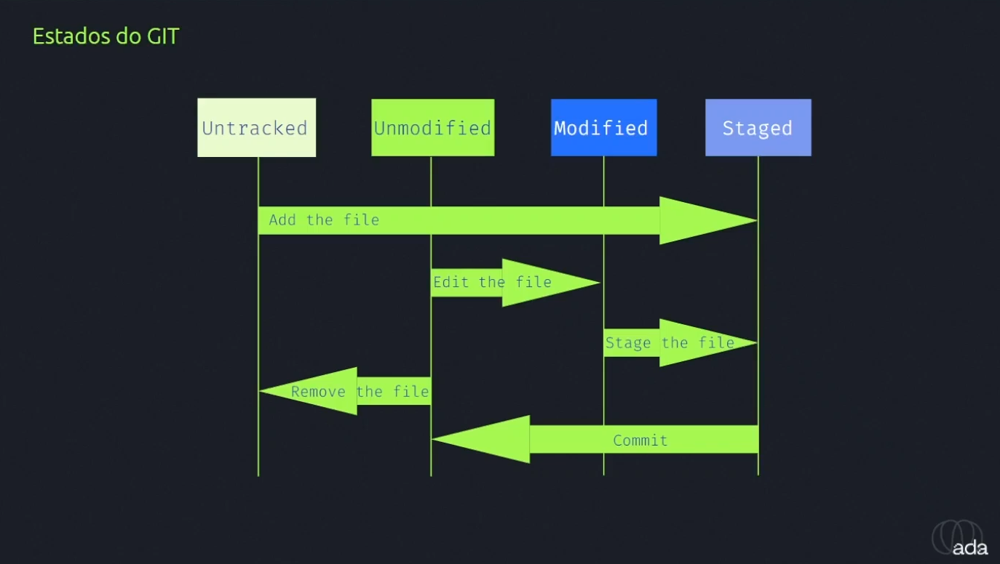

# Curso Ada Tech: Git e Github (Módulo Único)

## Tipos de estados que um arquivo pode está no github:

- Untraked (Não mapeado):  
    Um arquivo que não está "mapeado", ou seja, ainda não faz parte dos arquivos pertencentes ao repositório.

- Unmodified (Não modificado):  
    Um arquivo já pertencente e sincronzado ao repoitório.

- Modified (Modificado):  
    Um arquivo já pertencente ao repoitório porém, sofreu modificação e precisa ser sincronizado.

- Staged (Pronto para commit):  
    Um arquivo já pertencente ao repoitório que foi modificado e pronto para ser sincronizado.

---
## Comandos disponíveis para trabalhar com git por terminal

- *git status*  
    Verifica e indica o estado dos arquivos.

- *git diff*  
    Mostra que linhas foram modificadas.

- *git log*  
    Mostra os commits realizados até o momento.

- *git add &lt;arquivo&gt;*  
    Adiciona um arquivo para o estado de Staged.

- *git commit -m "mensagem"*  
    Cria um commit para sincronizar os arquivos no repositório e passa uma mensagem do que foi modificado.

    qkjshk.hgdakhsbdjqshgd